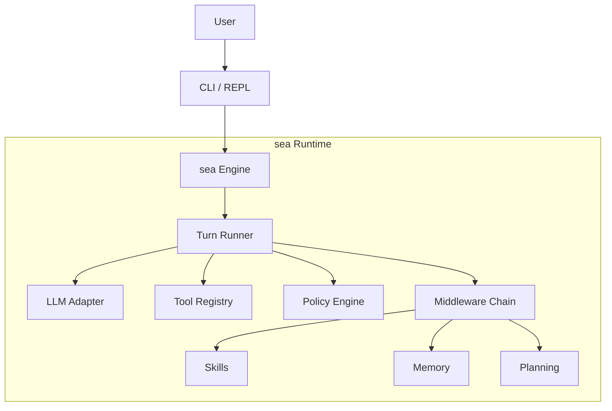

# sea (Skill Engine Agent)

> **"The ocean accepts all streams."**
> 
> *Imagine an agent runtime as vast and inclusive as the sea—capable of executing any skill you define, turning your intentions into actions.*

**sea** is a lightweight, Go-based agent runtime designed to be the universal engine for AI skills. It combines:
- **S**kill: Portable capabilities defined in `SKILL.md`.
- **E**ngine: A robust, single-binary runtime for executing tools and managing state.
- **A**gent: An intelligent entity that uses the engine to accomplish complex tasks.

---

## Why sea?

Most agent frameworks are heavy, Python-first, or tightly coupled to specific providers. **sea** takes a different approach:
- **🌊 Engine-First**: A stable event protocol + runtime that powers CLI, TUI, or IDE tools.
- **🐚 Skill-First**: Capabilities are defined in portable `SKILL.md` files, not hardcoded logic.
- **⚓️ Safe by Default**: Side-effects (file edits, shell commands) are gated behind Human-in-the-Loop (HITL) approvals.
- **🚀 Native Performance**: A single, static Go binary. No Python venv hell.

## Features

| Feature | Description |
|---|---|
| **Portable Skills** | Define workflows in `SKILL.md` (Markdown + Frontmatter) that any agent can read. |
| **HITL Approvals** | Interactive approvals with diff previews for risky actions. Run safely. |
| **Built-in Tools** | `ls`, `read_file`, `write_file`, `edit_file`, `grep`, `shell`, `lsp_diagnostics`. |
| **Memory & Context** | Structured persistence for user preferences and project facts under `workspace/`. |
| **Session Management** | Save, resume, and audit sessions. Time-travel through your agent's work. |
| **Event Stream** | Real-time streaming protocol for developers (Thinking, ToolCalls, Deltas). |
| **REPL** | A powerful interactive CLI (`./sea chat`) for chatting with your agent. |

## Quick Start

## Installation

### Option 1: Quick Install (Recommended)

Run this command in your terminal to download and set up `sea` automatically:

```bash
curl -fsSL https://raw.githubusercontent.com/lucas-zan/agent-sea/main/install.sh | bash
```

### Option 2: Manual Download

1. Go to the [Releases](https://github.com/lucas-zan/agent-sea/releases) page.
2. Download the binary for your OS (Windows, macOS, Linux).
3. Rename it to `sea` (or `sea.exe` on Windows) and make it executable:
   ```bash
   chmod +x sea
   ./sea help
   ```

### Option 2: Build from Source

This project requires Go 1.24+.

```bash
git clone https://github.com/lucas-zan/agent-sea.git
cd agent-sea
make native
# Output: ./sea
```

### Option 3: Run with Docker

If you don't have Go installed, you can use Docker:

```bash
docker compose run --rm dev ./sea chat
```


### 2. Configure

Set up your LLM provider (OpenAI-compatible).

```bash
cat > .env <<'EOF'
LLM_API_KEY=sk-your-api-key
LLM_BASE_URL=https://api.openai.com/v1
LLM_MODEL=gpt-4o-mini
LOG_LEVEL=INFO
EOF
```

### 3. Run

Start a chat session:

```

Or run a specific task directly:

```bash
# Ask the agent to do something
./sea chat --initial "Analyze the current directory layout"

# Auto-approve safe actions (optional)
./sea chat --auto-approve
```


## Chat & Sessions

Start a new session:
```bash
./sea chat
```

List previous sessions (history, status, IDs):
```bash
./sea chat --list
# Output:
# 📂 Sessions:
#   session_123... - 15 messages - 2026-01-21 10:00
```

Resume an existing session:
```bash
# Append the session ID to resume context
./sea chat session_123...
```

## Using Skills

In **sea**, capabilities are called "Skills". They are just directories with a `SKILL.md` file.

### Discovery
Skills are loaded from:
1. `<project>/.sea/skills/` (Project-specific)
2. `~/.sea/<agent>/skills/` (User-global)
3. `./skills/` (Built-in)

### Managing Skills

```bash
# List available skills
./sea skills

# Run a skill directly (headless mode)
./sea run novel-init -a name="MyNovel" -a genre="Sci-Fi"

# Validate a skill definition
./sea validate ./skills/my-new-skill
```

### Creating a Skill (`SKILL.md`)

```markdown
---
name: my-skill
description: A custom workflow.
allowed-tools: "read_file write_file"
---

# Instructions

1. Read the user's config file.
2. If distinct, update it with new defaults.
```

## Architecture

**sea** is designed as a modular layered architecture:



## Commands

| Command | Usage | Description |
|---|---|---|
| `chat` | `./sea chat` | Start interactive session. |
| `run` | `./sea run <skill>` | Execute a skill non-interactively. |
| `skills` | `./sea skills` | List all discovered skills. |
| `validate` | `./sea validate` | Check validity of all skills. |
| `help` | `./sea help` | Show help message. |

Inside the REPL (`chat`), you can use slash commands:
- `/help` - List commands
- `/init` - Initialize persona/config for current dir
- `/compress` - Compress conversation history (save tokens)
- `/quit` - Exit

## Contributing

**sea** is an open engine. We welcome contributions!

- **Issues**: Report bugs or suggest features.
- **PRs**: Submit improvements to the engine or new built-in skills.

## License

MIT
